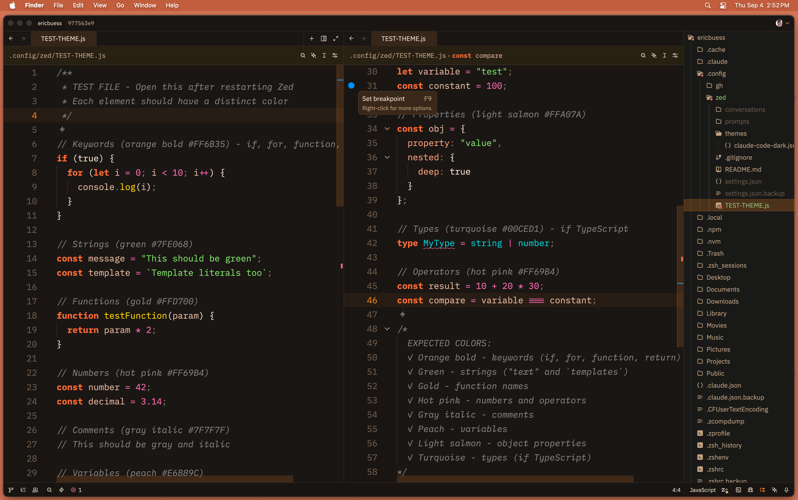

# Claude Code Inspired Dark Theme for Zed

A dark theme for the Zed editor inspired by Claude and Anthropic's brand colors, featuring warm orange accents and a comfortable coding environment.



## Features

### Design Philosophy
- **Warm color palette**: Based on Anthropic's brand colors with orange accents
- **Comfortable contrast**: Cream text on dark brown backgrounds for reduced eye strain
- **Semantic highlighting**: Each syntax element has a distinct, purposeful color

### Color Palette

#### Primary Colors
- **Claude Orange**: `#E67D22` - Keywords, accents, active elements
- **Light Orange**: `#FFB38A` - Functions, hover states
- **Cream**: `#F5E6D3` - Primary text, high contrast
- **Muted Tan**: `#C4A584` - Secondary text, parameters

#### Syntax Highlighting
- **Keywords**: Claude orange with increased weight
- **Functions**: Light orange, italicized for methods
- **Strings**: Warm green (#98C379)
- **Numbers**: Coral (#FF9966)
- **Comments**: Muted tan, italicized
- **Types**: Soft blue (#61AFEF) for contrast
- **Variables**: Cream for readability

### UI Elements

#### Editor
- Dark backgrounds with warm brown undertones
- Active line highlighting with subtle orange accent
- Orange-tinted scrollbars and selections
- Line numbers in muted colors, active line in orange

#### Panels & Surfaces
- Layered backgrounds for depth perception
- Slightly lighter surfaces for panels and sidebars
- Consistent border colors throughout

#### Status Indicators
- **Git**: Green (created), Orange (modified), Red (deleted)
- **Diagnostics**: Warm palette for errors/warnings/info
- **Success**: Warm green matching the overall theme

### Terminal Colors
Full ANSI color palette with warm-tinted variants matching the Claude aesthetic.


## Installation

### Option 1: Install from Zed Extension Registry (Coming Soon)
Once published, you'll be able to install directly from Zed:
1. Open Zed's command palette (`cmd-shift-p` on macOS)
2. Type "Extensions" and select "zed: extensions"
3. Search for "Claude Code Inspired Dark"
4. Click Install

### Option 2: Install as Dev Extension
1. Clone this repository:
```bash
git clone https://github.com/ericbuess/claude-code-inspired-dark.git
```

2. In Zed, open the command palette (`cmd-shift-p` on macOS)

3. Type "install dev extension" and select `zed: install dev extension`

4. Navigate to the cloned repository folder and select it

5. Restart Zed when prompted

6. Open settings (`cmd-,`) and select "Claude Code Inspired Dark" from the theme picker

## Customization Tips

### Desktop Wallpaper
For a cohesive look, consider using a complementary wallpaper:
- Solid dark backgrounds work best
- Orange or warm-toned gradients complement the theme
- Claude's brand coral (`#D97757`) or theme orange (`#E67D22`) create a unified aesthetic

### macOS System Settings
For optimal visual experience with the Claude theme:
1. **Window Tiling**: Drag Zed window to top-middle of screen
   - Creates a small border around the window
   - Allows wallpaper to show through on all sides
   - Enhances the transparency effect
2. **Reduce Motion**: Turn OFF in System Settings → Accessibility → Display
   - Allows smooth theme transitions and hover effects
3. **Cursor Colors**: Match cursor to theme colors
   - System Settings → Accessibility → Display → Pointer
   - Set to match theme accent colors

## File Structure
```
.
├── extension.toml           # Extension manifest
├── themes/
│   └── claude-code-inspired-dark.json   # Theme definition
├── screenshot.png           # Theme preview
├── README.md               # This file
└── LICENSE                 # MIT license
```

## Repository
This theme is open source and available at:
https://github.com/ericbuess/claude-code-inspired-dark

## Credits
Created with Claude's assistance for optimal VM distinction and brand consistency.